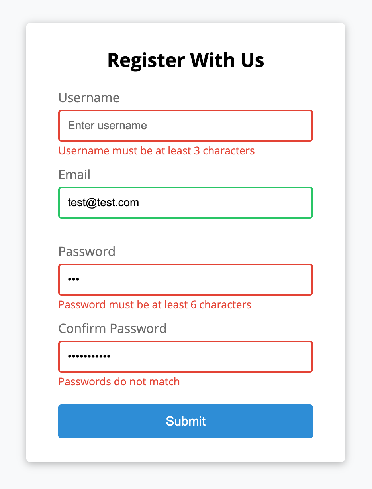

# Mini JavaScript Projects

Welcome to my repository of mini-projects built entirely using HTML, CSS, and Vanilla JavaScript

    

## Live Demo

You can check out the live version of these projects on GitHub Pages here:  
👉 [View Live Demo](https://rhodapickens.github.io/javascript-mini-projects/)

---

## Projects

### 1. Form Validator

A robust, client-side form validation interface that gives real-time visual feedback upon submission.

#### Features

- **Field Requirement Checks:** Ensures username, email, password, and password confirmation fields are not left blank.
- **Length Validation:** Restricts the username and password to specific minimum and maximum character lengths.
- **Email Format Verification:** Uses a regular expression to ensure the email address matches a standard pattern.
- **Password Matching:** Verifies that the "Confirm Password" field matches the original password.
- **Dynamic UI Feedback:** When the user clicks submit, invalid fields highlight in **red** with a custom error message, while valid fields turn **green**.

#### Tech Stack & Concepts Covered

- Semantic HTML5 Form layout
- CSS3 custom variables and transition effects for success/error states
- JavaScript Event Listeners
- DOM Manipulation
